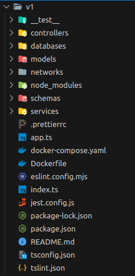

# Versionamiento

Podemos ver la estructura al entrar al backend que esta por versiones, esto es ya que la misma api tendra varias versiones diferentes donde vamos a evaluar que version es mas eficiente para el proyecto

al dia de hoy solo esta la version 1 "v1" el cual es un proyecto contruido con Express.js y TypeScript




# Instalacion

## Version 1

Sigue los siguientes pasos para instalar el backend de la version 1

**Nota:** Estos pasos los puedes conseguir igualmente en el README.md


### Local
```bash
npm run start:dev
```

# Testing

## Version 1

Sigue los siguientes pasos para probar el backend de la version 1

**Nota:** Estos pasos los puedes conseguir igualmente en el README.md

### Local
```bash
npm run test

OR

npm run test:e2e
```

### ci / cd


